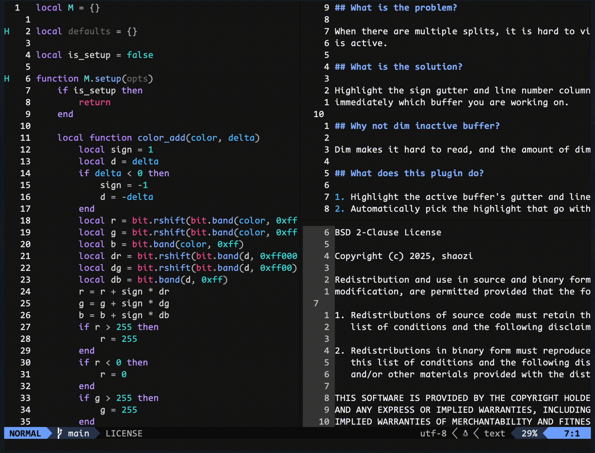

## What is the problem?

When there are multiple splits, it is hard to visually tell which buffer window
is active.

## What is the solution?

Highlight the sign gutter and line number column of the active buffer so you know
immediately which buffer you are working on.

## Why not dim inactive buffers?

Dim makes it hard to read, and the amount of dim is not enough to make the active buffer stand out.

## What does this plugin do?

1. Highlight the active buffer's gutter and line number column
2. Automatically pick the highlight colors from your colorscheme
3. No configuration is need

## How to use it?

Simply add this plugin and that is it.

## In action

